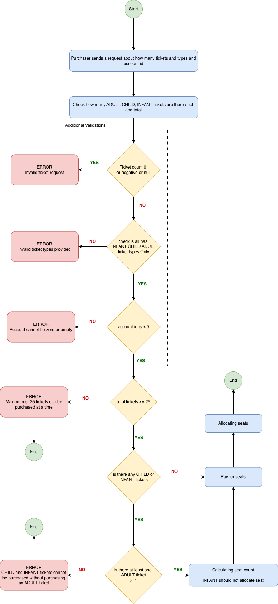

# Cinema Tickets Code Test

## 1. Business Rules

Following is the flow diagram of the business rule provided in the assignment



## 2. Assumptions

### Additional assumptions along with business rules

1. A purchase request must contain at least one ticket.

2. A ticket quantity must be greater than zero.  
   For example, `ADULT x 0` or `CHILD x -1` is considered invalid.

3. If any ticket request is invalid, the whole purchase request is rejected and no partial processing.

4. The maximum ticket limit of 25 applies to the total number of tickets requested, including ADULT, CHILD, and INFANT tickets.

5. One ADULT ticket is enough to allow CHILD and INFANT tickets.  

6. Account IDs of zero or less are considered invalid.

7. Invalid requests are rejected before calling external services.

8. Ticket prices are treated as fixed for this implementation and are not loaded from an external configuration source.

## 3. Testing Approach

Main valid cases:

1. One ADULT ticket.
2. Multiple ADULT tickets.
3. ADULT and CHILD tickets.
4. ADULT and INFANT tickets.
5. ADULT, CHILD, and INFANT tickets.
6. Exactly 25 tickets.
7. Multiple requests for the same ticket type are aggregated correctly.
   - Example: `ADULT x 1`, `ADULT x 2` should be treated as `ADULT x 3`.
8. Exactly 25 tickets including INFANT tickets.
   - Example: `ADULT x 10`, `CHILD x 10`, `INFANT x 5`.

Invalid cases:

1. More than 25 tickets.
2. CHILD without ADULT.
3. INFANT without ADULT.
4. CHILD and INFANT without ADULT.
5. Zero ticket quantity.
6. Negative ticket quantity.
7. Invalid account ID.
8. Null ticket requests.
9. Empty ticket requests.
10. Null ticket request inside the request array.
    - Example: `ADULT x 1`, `null`.
11. Null ticket type, if the domain model allows it.
12. Any invalid ticket in a larger request rejects the whole purchase.
    - Example: `ADULT x 2`, `CHILD x -1`, `INFANT x 1`.
13. Mixed ticket request exceeding 25 tickets.
    - Example: `ADULT x 10`, `CHILD x 10`, `INFANT x 6`.

## 4. REST endpoints and request bodies

```http
POST /cinema/accounts/{accountId}/ticket-purchases
```

E.g. Request
```json
[
  {
    "type": "ADULT",
    "ticketCount": 2
  },
  {
    "type": "CHILD",
    "ticketCount": 1
  },
  {
    "type": "INFANT",
    "ticketCount": 1
  }
]
```

E.g. Response
```json
{
  "status": "SUCCESS",
  "message": "Tickets purchased successfully",
  "accountId": 1,
  "totalTicketsPurchased": 6,
  "totalSeatsReserved": 5,
  "totalAmountPaid": 95,
  "ticketBreakdown": [
    {
      "type": "ADULT",
      "ticketCount": 2,
      "pricePerTicket": 25,
      "totalCost": 50,
      "seatsReserved": 2
    },
    {
      "type": "CHILD",
      "ticketCount": 3,
      "pricePerTicket": 15,
      "totalCost": 45,
      "seatsReserved": 3
    },
    {
      "type": "INFANT",
      "ticketCount": 1,
      "pricePerTicket": 0,
      "totalCost": 0,
      "seatsReserved": 0
    }
  ]
}
```

For any error response will be following 

```json
{
  "type": "INVALID_BOOKING_REQUEST",
  "title": "Invalid booking request",
  "status": 400,
  "detail": "CHILD and INFANT tickets cannot be purchased without an ADULT ticket",
  "timestamp": "2026-05-15T10:30:45Z"
}
```

## 5. Project setup

### Prerequisites

Before running the project, make sure the following are installed:

- Java 21 or above
- Maven
- Git

You can check your Java version with:

```bash
java -version
```

### How to Run Tests

```bash
mvn clean test
```

Install dependencies 

```bash
mvn clean install
```

### How to start 

```bash
mvn spring-boot:run
```

By default, the application should start on:

```http
http://localhost:8080
```